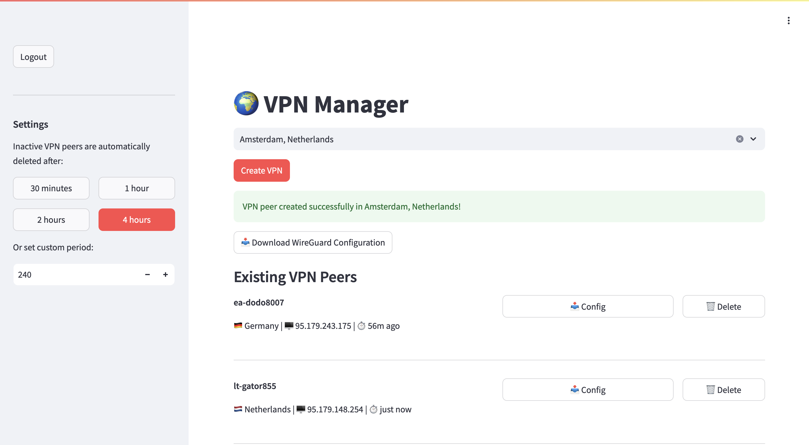

# WireGuard VPN Server Deployer and Manager
## Overview



This project provides an effortless way to spin up your own temporary, cost-effective WireGuard VPN servers on-demand—no long-term subscriptions or complex manual setups required. By leveraging popular VPS providers like Vultr or Linode, it automatically:

- Deploys on Demand: Quickly launch a fresh VPS instance with WireGuard pre-installed.
- Easy Configuration: Generate and manage user profiles with a user-friendly GUI.
- Automatic Cleanup: Idle VPN servers are automatically torn down after a set period of inactivity, ensuring you only pay for what you use.
- Enhanced Privacy: Retain full control over your VPN infrastructure and connections, eliminating the need to trust external VPN services.

In short, this tool lets you enjoy a secure, private VPN connection whenever you need it and stop paying the moment you’re done.

## How to run on local computer

To run the auto-vpn Docker image on your machine, follow the steps below.

Use the following one-liner to start the container:

```
docker run --rm -d --pull always --name auto-vpn \
  -e USERNAME=admin \
  -e PASSWORD=qwerty \
  -e VULTR_API_KEY=<your-vultr-api-key> \
  -v $(pwd)/data_layer:/app/data_layer \
  -p 8501:8501 \
  ghcr.io/g1ibby/auto-vpn:main
```

### Notes
Make sure that `$(pwd)/data_layer` exists
### Environment Variables:
- USERNAME and PASSWORD: Required for admin access.
- Either VULTR_API_KEY or LINODE_API_KEY must be set for provider API integration.
- If DATABASE_URL is not set, a local SQLite database will be used at data_layer.db in the container. This is mapped to your current working directory.

Make sure to replace the placeholder values (e.g., VULTR_API_KEY) with your actual credentials.
This command will launch the auto-vpn service, accessible at http://localhost:8501.

## Run on free render.com

Getting this application running on Render’s free tier is straightforward:

1. Create a New Service:
- Go to your Render Dashboard and create a new Web Service.
- When prompted for the service’s environment, choose Docker.
- Provide the Docker image:
`
ghcr.io/g1ibby/auto-vpn:main
`

2. Set Environment Variables:
Under the Environment tab, add the necessary variables:

- USERNAME: Set your desired admin username (e.g., admin).
- PASSWORD: Set your desired admin password (e.g., qwerty).
- VULTR_API_KEY or LINODE_API_KEY: Provide your chosen VPS provider’s API key.
- SELF_URL: Use the domain that Render assigns to your service (e.g., https://your-service.onrender.com). The application will ping this URL periodically to stay active on the free tier.

(Optional)

- DATABASE_URL: If you need persistent storage, consider using Supabase to create a hosted PostgreSQL database. Set the DATABASE_URL to the connection string provided by Supabase. This ensures your VPN configuration and user data remain intact, even if the container restarts.

3. Configure Ports and Start:

- Render will automatically detect the service’s port (default: 8501).
- Deploy your service. Once deployed, the application should be accessible at the SELF_URL you provided.

4. Keep Your Service Running on the Free Tier:
Thanks to the SELF_URL setting, the app pings itself every few minutes. This behavior helps keep your service running on Render’s free tier by showing activity and preventing automatic shutdown due to inactivity.

## Under the Hood

- Pulumi: Handles infrastructure provisioning, making it simple to deploy and tear down VPS instances on-demand.
- [Nyr/wireguard-install](https://github.com/Nyr/wireguard-install): Automates the WireGuard installation process, ensuring a seamless setup experience.
- [Streamlit](https://streamlit.io): GUI
